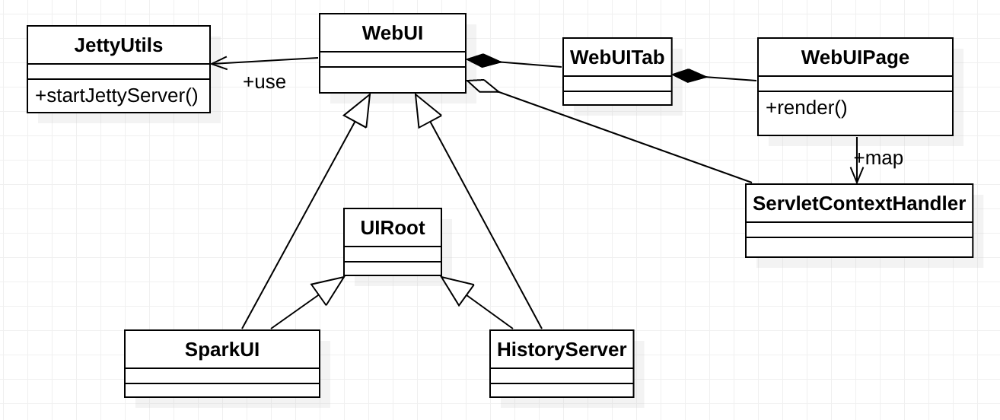
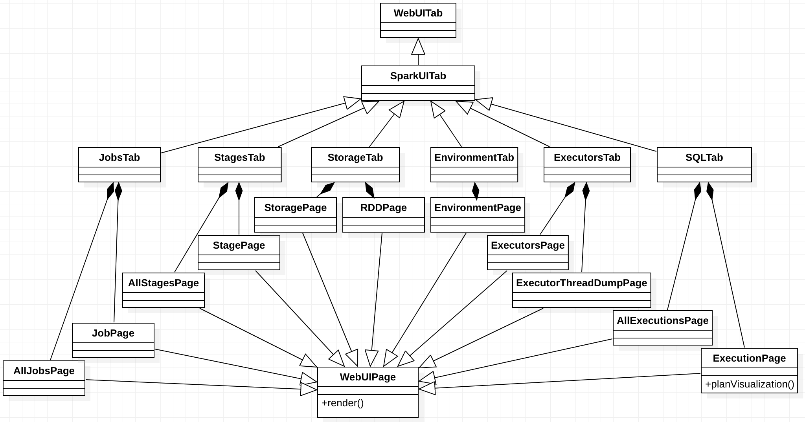
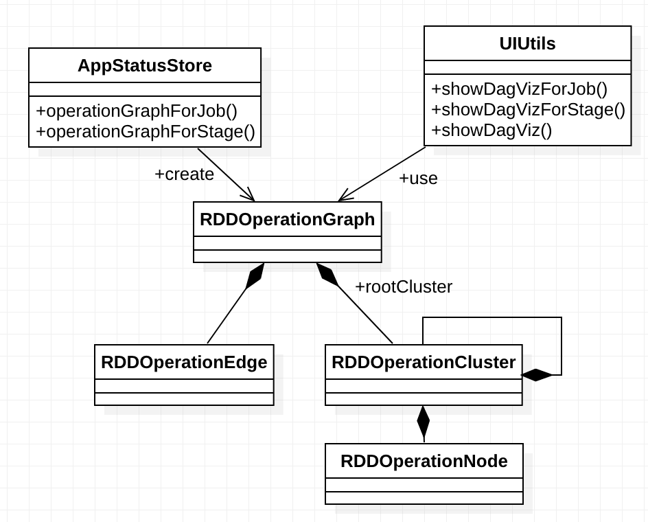
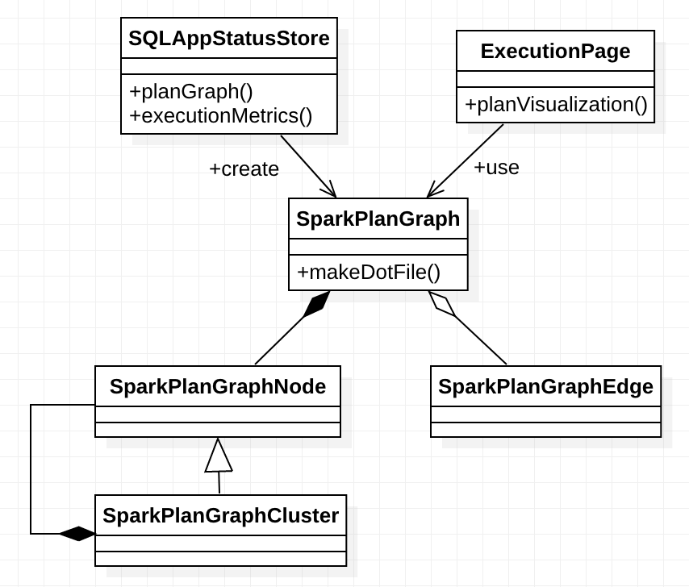
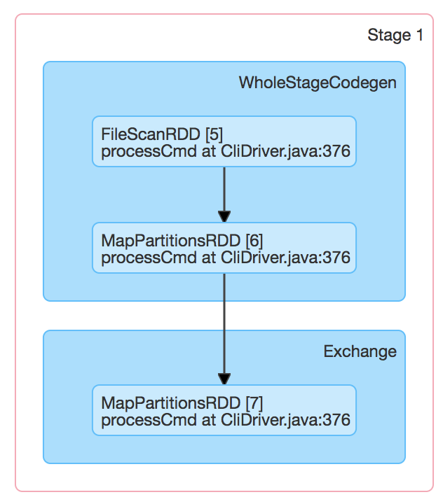
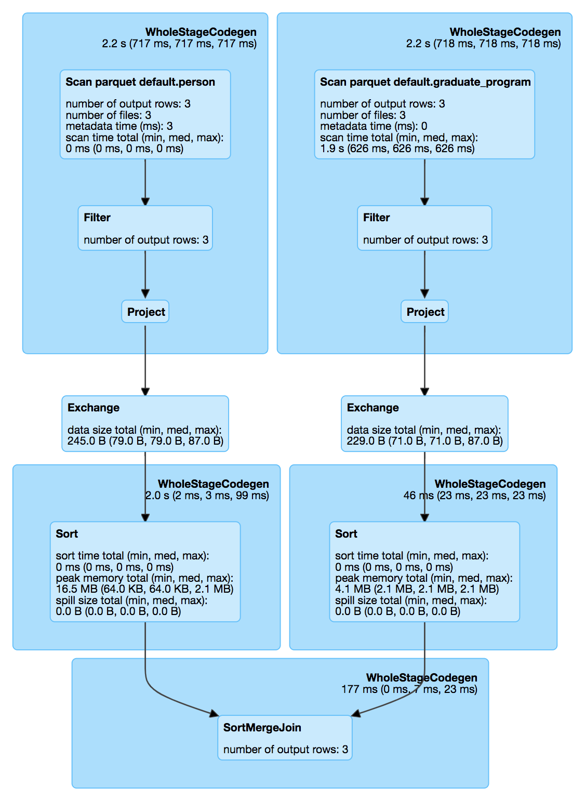

# Core WebUI

## Overview


## Design and Implementation

### WebUI Overview



### SparkUI Tabs and Pages



### RDD Operation Graph



`RDDOperationGraph` is a representation of a generic cluster graph used for storing information on
RDD operations. Each graph is defined with a set of edges and a root cluster, which may contain
children nodes and children clusters. Additionally, a graph may also have edges that enter or exit
the graph from nodes that belong to adjacent graphs.

Base on app status stored in `AppStatusStore`, `RDDOperationGraph` can be constructed, which can
then be used by `UIUtils` to do visualization (HTML/CSS/JavaScript codes).

### SparkPlan Graph



`SparkPlanGraph` is a graph used for storing information of an executionPlan of DataFrame. Each
graph is defined with a set of nodes and a set of edges. Each node represents a node in the
SparkPlan tree, and each edge represents a parent-child relationship between two nodes.

Base on SQL app status stored in `SQLAppStatusStore`, `SparkPlanGraph` can be constructed, which can
then be used by ExecutionPage to do visualization (HTML/CSS/JavaScript codes).

### DAG Visualization
`core/src/main/resources/org/apache/spark/ui/static/`

```
spark-dag-viz.js
spark-dag-viz.css
```

spark-sql-viz uses:

* graphlib-dot.min.js: data structures and algorithms for parsing dot file
* dagre-d3: layout
* d3: rendering

## Case Study

### Job DAG Viz


```
<div>
  <!-- job-dag-viz -->
  <span id="job-dag-viz" class="expand-dag-viz" onclick="toggleDagViz(true);">
    <span class="expand-dag-viz-arrow arrow-closed"></span>
    <a data-toggle="tooltip" title="Shows a graph of stages executed for this job, each of which can contain
   multiple RDD operations (e.g. map() and filter()), and of RDDs inside each operation
   (shown as dots)." data-placement="right">
      DAG Visualization
    </a>
  </span>

  <!-- dag-viz-graph -->
  <div id="dag-viz-graph"></div>

  <!-- dag-viz-metadata -->
  <div id="dag-viz-metadata" style="display:none">
    <!-- stage-metadata-0 -->
    <div class="stage-metadata" stage-id="0" skipped="false">
      <div class="dot-file">digraph G {
  subgraph clusterstage_0 {
    label=&quot;Stage 0&quot;;
    subgraph cluster7 {
      label=&quot;WholeStageCodegen&quot;;
      0 [label=&quot;FileScanRDD [0]\nprocessCmd at CliDriver.java:376&quot;];
      1 [label=&quot;MapPartitionsRDD [1]\nprocessCmd at CliDriver.java:376&quot;];
    }
    subgraph cluster6 {
      label=&quot;Exchange&quot;;
      2 [label=&quot;MapPartitionsRDD [2]\nprocessCmd at CliDriver.java:376&quot;];
    }
  }
  0-&gt;1;
  1-&gt;2;
}</div></div>
    <!-- stage-metadata-1 -->
    <div class="stage-metadata" stage-id="1" skipped="false">
      <div class="dot-file">digraph G {
  subgraph clusterstage_1 {
    label=&quot;Stage 1&quot;;
    subgraph cluster16 {
      label=&quot;WholeStageCodegen&quot;;
      5 [label=&quot;FileScanRDD [5]\nprocessCmd at CliDriver.java:376&quot;];
      6 [label=&quot;MapPartitionsRDD [6]\nprocessCmd at CliDriver.java:376&quot;];
    }
    subgraph cluster15 {
      label=&quot;Exchange&quot;;
      7 [label=&quot;MapPartitionsRDD [7]\nprocessCmd at CliDriver.java:376&quot;];
    }
  }
  5-&gt;6;
  6-&gt;7;
}</div></div>
    <!-- stage-metadata-2 -->
    <div class="stage-metadata" stage-id="2" skipped="false">
      <div class="dot-file">digraph G {
  subgraph clusterstage_2 {
    label=&quot;Stage 2&quot;;
    subgraph cluster6 {
      label=&quot;Exchange&quot;;
      3 [label=&quot;ShuffledRowRDD [3]\nprocessCmd at CliDriver.java:376&quot;];
    }
    subgraph cluster3 {
      label=&quot;WholeStageCodegen&quot;;
      4 [label=&quot;MapPartitionsRDD [4]\nprocessCmd at CliDriver.java:376&quot;];
    }
    subgraph cluster15 {
      label=&quot;Exchange&quot;;
      8 [label=&quot;ShuffledRowRDD [8]\nprocessCmd at CliDriver.java:376&quot;];
    }
    subgraph cluster12 {
      label=&quot;WholeStageCodegen&quot;;
      9 [label=&quot;MapPartitionsRDD [9]\nprocessCmd at CliDriver.java:376&quot;];
    }
    subgraph cluster0 {
      label=&quot;WholeStageCodegen&quot;;
      10 [label=&quot;ZippedPartitionsRDD2 [10]\nprocessCmd at CliDriver.java:376&quot;];
      11 [label=&quot;MapPartitionsRDD [11]\nprocessCmd at CliDriver.java:376&quot;];
    }
    subgraph cluster20 {
      label=&quot;mapPartitionsInternal&quot;;
      12 [label=&quot;MapPartitionsRDD [12]\nprocessCmd at CliDriver.java:376&quot;];
    }
  }
  3-&gt;4;
  8-&gt;9;
  4-&gt;10;
  9-&gt;10;
  10-&gt;11;
  11-&gt;12;
}</div>
<div class="incoming-edge">2,3</div><div class="incoming-edge">7,8</div>
</div>
  </div><!-- dag-viz-metadata -->

</div>
```

### Stage DAG Viz





```
<div>
  <span id="stage-dag-viz" class="expand-dag-viz" onclick="toggleDagViz(false);">
    <span class="expand-dag-viz-arrow arrow-closed"></span>
    <a data-toggle="tooltip" title="Shows a graph of RDD operations in this stage, and RDDs inside each one. A stage can run
   multiple operations (e.g. two map() functions) if they can be pipelined. Some operations
   also create multiple RDDs internally. Cached RDDs are shown in green.
" data-placement="right">
      DAG Visualization
    </a>
  </span>

  <div id="dag-viz-graph"></div>

  <div id="dag-viz-metadata" style="display:none">

    <div class="stage-metadata" stage-id="2" skipped="false">
      <div class="dot-file">digraph G {
  subgraph clusterstage_2 {
    label=&quot;Stage 2&quot;;
    subgraph cluster6 {
      label=&quot;Exchange&quot;;
      3 [label=&quot;ShuffledRowRDD [3]\nprocessCmd at CliDriver.java:376&quot;];
    }
    subgraph cluster3 {
      label=&quot;WholeStageCodegen&quot;;
      4 [label=&quot;MapPartitionsRDD [4]\nprocessCmd at CliDriver.java:376&quot;];
    }
    subgraph cluster15 {
      label=&quot;Exchange&quot;;
      8 [label=&quot;ShuffledRowRDD [8]\nprocessCmd at CliDriver.java:376&quot;];
    }
    subgraph cluster12 {
      label=&quot;WholeStageCodegen&quot;;
      9 [label=&quot;MapPartitionsRDD [9]\nprocessCmd at CliDriver.java:376&quot;];
    }
    subgraph cluster0 {
      label=&quot;WholeStageCodegen&quot;;
      10 [label=&quot;ZippedPartitionsRDD2 [10]\nprocessCmd at CliDriver.java:376&quot;];
      11 [label=&quot;MapPartitionsRDD [11]\nprocessCmd at CliDriver.java:376&quot;];
    }
    subgraph cluster20 {
      label=&quot;mapPartitionsInternal&quot;;
      12 [label=&quot;MapPartitionsRDD [12]\nprocessCmd at CliDriver.java:376&quot;];
    }
  }
  3-&gt;4;
  8-&gt;9;
  4-&gt;10;
  9-&gt;10;
  10-&gt;11;
  11-&gt;12;
}</div>
      <div class="incoming-edge">2,3</div><div class="incoming-edge">7,8</div>
    </div>
  </div>

</div>
```

### SQL DAG Viz


```
<div>
  <div id="plan-viz-graph"></div>
  <div id="plan-viz-metadata" style="display:none">
    <div class="dot-file">
      digraph G {

  subgraph cluster0 {
    label=&quot;WholeStageCodegen\n\n\n177 ms (0 ms, 7 ms, 23 ms)&quot;;
      1 [label=&quot;SortMergeJoin\n \nnumber of output rows: 3&quot;];
  }
     

  subgraph cluster2 {
    label=&quot;WholeStageCodegen\n\n\n2.0 s (2 ms, 3 ms, 99 ms)&quot;;
      3 [label=&quot;Sort\n \nsort time total (min, med, max): \n0 ms (0 ms, 0 ms, 0 ms)\npeak memory total (min, med, max): \n16.5 MB (64.0 KB, 64.0 KB, 2.1 MB)\nspill size total (min, med, max): \n0.0 B (0.0 B, 0.0 B, 0.0 B)&quot;];
  }
     
  4 [label=&quot;Exchange\n \ndata size total (min, med, max): \n245.0 B (79.0 B, 79.0 B, 87.0 B)&quot;];

  subgraph cluster5 {
    label=&quot;WholeStageCodegen\n\n\n2.2 s (717 ms, 717 ms, 717 ms)&quot;;
      6 [label=&quot;Project&quot;];    
  7 [label=&quot;Filter\n \nnumber of output rows: 3&quot;];    
  8 [label=&quot;Scan parquet default.person\n \nnumber of output rows: 3\nnumber of files: 3\nmetadata time (ms): 3\nscan time total (min, med, max): \n0 ms (0 ms, 0 ms, 0 ms)&quot;];
  }
     

  subgraph cluster9 {
    label=&quot;WholeStageCodegen\n\n\n46 ms (23 ms, 23 ms, 23 ms)&quot;;
      10 [label=&quot;Sort\n \nsort time total (min, med, max): \n0 ms (0 ms, 0 ms, 0 ms)\npeak memory total (min, med, max): \n4.1 MB (2.1 MB, 2.1 MB, 2.1 MB)\nspill size total (min, med, max): \n0.0 B (0.0 B, 0.0 B, 0.0 B)&quot;];
  }
     
  11 [label=&quot;Exchange\n \ndata size total (min, med, max): \n229.0 B (71.0 B, 71.0 B, 87.0 B)&quot;];

  subgraph cluster12 {
    label=&quot;WholeStageCodegen\n\n\n2.2 s (718 ms, 718 ms, 718 ms)&quot;;
      13 [label=&quot;Project&quot;];    
  14 [label=&quot;Filter\n \nnumber of output rows: 3&quot;];    
  15 [label=&quot;Scan parquet default.graduate_program\n \nnumber of output rows: 3\nnumber of files: 3\nmetadata time (ms): 0\nscan time total (min, med, max): \n1.9 s (626 ms, 626 ms, 626 ms)&quot;];
  }
     
  3-&gt;1;

  4-&gt;3;

  6-&gt;4;

  7-&gt;6;

  8-&gt;7;

  10-&gt;1;

  11-&gt;10;

  13-&gt;11;

  14-&gt;13;

  15-&gt;14;

}
    </div>

    <div id="plan-viz-metadata-size">16</div>
    
    <div id="plan-meta-data-1">SortMergeJoin [graduate_program#2], [id#4], Inner</div>
    <div id="plan-meta-data-0">WholeStageCodegen</div>
    <div id="plan-meta-data-3">Sort [graduate_program#2 ASC NULLS FIRST], false, 0</div>
    <div id="plan-meta-data-2">WholeStageCodegen</div>
    <div id="plan-meta-data-4">Exchange hashpartitioning(graduate_program#2, 200)</div>
    <div id="plan-meta-data-6">Project [id#0, name#1, graduate_program#2, spark_status#3]</div>
    <div id="plan-meta-data-7">Filter isnotnull(graduate_program#2)</div>
    <div id="plan-meta-data-8">FileScan parquet default.person[id#0,name#1,graduate_program#2,spark_status#3] Batched: false, Format: Parquet, Location: InMemoryFileIndex[file:/user/hive/warehouse/person], PartitionFilters: [], PushedFilters: [IsNotNull(graduate_program)], ReadSchema: struct&lt;id:int,name:string,graduate_program:int,spark_status:array&lt;int&gt;&gt;</div>
    <div id="plan-meta-data-5">WholeStageCodegen</div>
    <div id="plan-meta-data-10">Sort [id#4 ASC NULLS FIRST], false, 0</div>
    <div id="plan-meta-data-9">WholeStageCodegen</div>
    <div id="plan-meta-data-11">Exchange hashpartitioning(id#4, 200)</div>
    <div id="plan-meta-data-13">Project [id#4, degree#5, department#6, school#7]</div>
    <div id="plan-meta-data-14">Filter isnotnull(id#4)</div>
    <div id="plan-meta-data-15">FileScan parquet default.graduate_program[id#4,degree#5,department#6,school#7] Batched: true, Format: Parquet, Location: InMemoryFileIndex[file:/user/hive/warehouse/graduate_program], PartitionFilters: [], PushedFilters: [IsNotNull(id)], ReadSchema: struct&lt;id:int,degree:string,department:string,school:string&gt;</div>
    <div id="plan-meta-data-12">WholeStageCodegen</div>
  </div>

  <link rel="stylesheet" href="/static/sql/spark-sql-viz.css" type="text/css"/>
  <script src="/static/d3.min.js"></script>
  <script src="/static/dagre-d3.min.js"></script>
  <script src="/static/graphlib-dot.min.js"></script>
  <script src="/static/sql/spark-sql-viz.js"></script>
  <script>$(function() { renderPlanViz(); })</script>
</div>
```

## Misc

### Skipped stages
* http://stackoverflow.com/questions/34580662/what-does-stage-skipped-mean-in-apache-spark-web-ui
* https://github.com/apache/spark/pull/3009
* http://blog.csdn.net/u012684933/article/details/50378725

